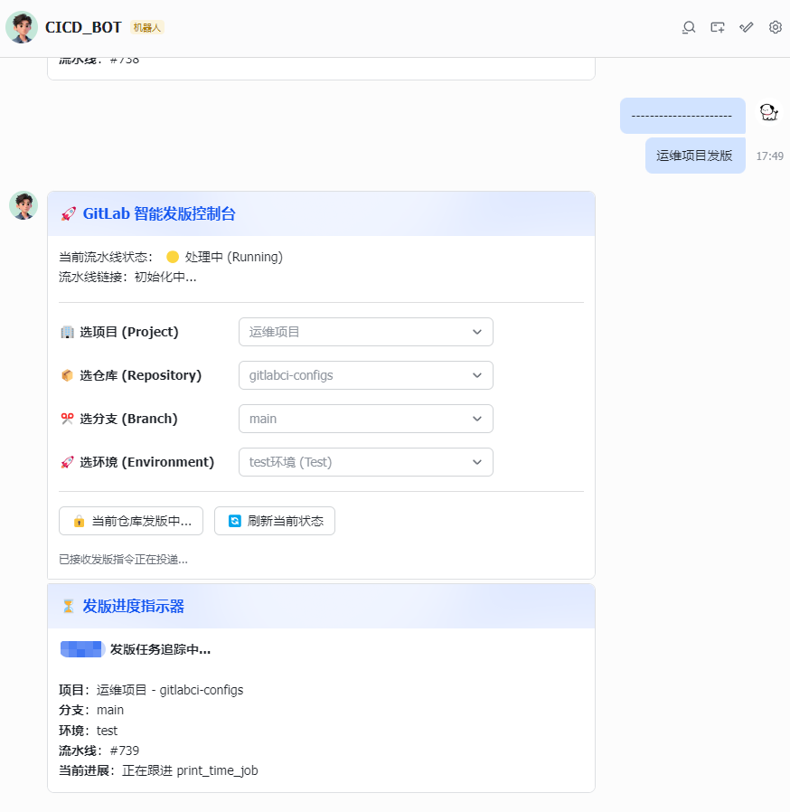
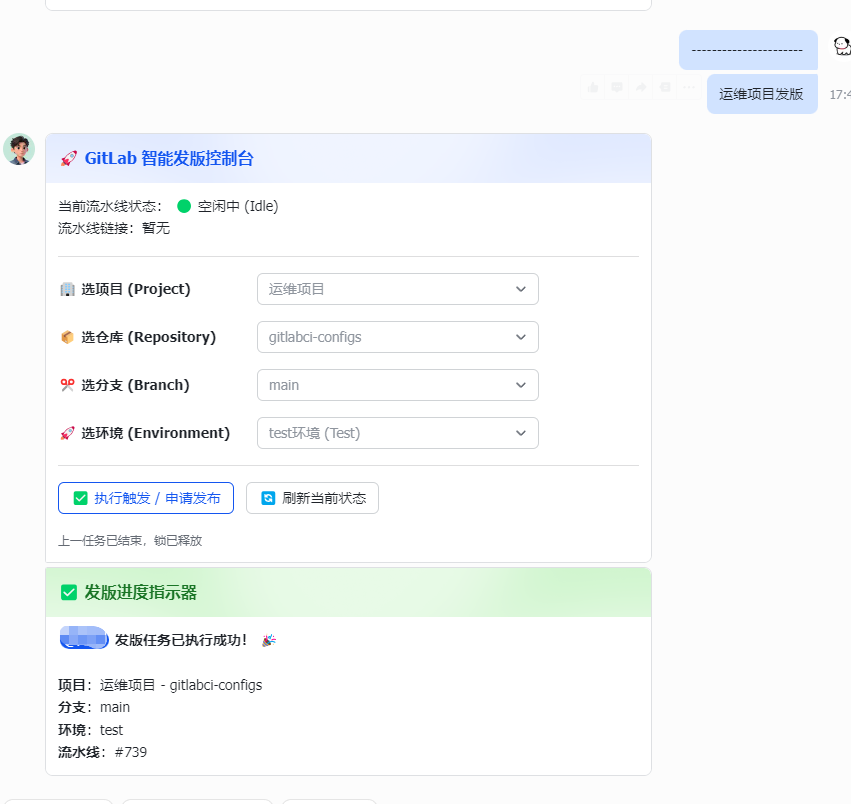

<p align="center">
  <h1 align="center">🚀 FeishuCardOps</h1>
  <p align="center">
    <strong>飞书卡片驱动的 GitLab CI/CD 智能发版控制台</strong>
  </p>
  <p align="center">
    在飞书群聊中通过交互式卡片，一键触发、追踪和管理 GitLab 流水线部署
  </p>
  <p align="center">
    <a href="#-核心功能">功能</a> •
    <a href="#-系统架构">架构</a> •
    <a href="#-快速开始">快速开始</a> •
    <a href="#-配置说明">配置</a> •
    <a href="#-使用方式">使用</a>
  </p>
</p>

---

## 💡 项目简介

**FeishuCardOps** 是一款基于飞书交互卡片的 GitLab CI/CD 流水线管理工具。无需打开浏览器、无需登录 GitLab，在飞书群聊中即可完成从选择项目到触发部署的全部操作。

**一句话发版：** 在群聊中发送 `项目名 + 发版`，即刻唤醒智能发版控制台。

---

## 📸 效果预览

<table>
  <tr>
    <td align="center"><strong>🔒 发版进行中 · 按钮自动锁定</strong></td>
    <td align="center"><strong>✅ 发版完成 · 锁已释放</strong></td>
  </tr>
  <tr>
    <td></td>
    <td></td>
  </tr>
  <tr>
    <td align="center"><sub>主卡状态变为「处理中」，按钮变为灰色🔒<br/>副卡实时追踪当前流水线阶段</sub></td>
    <td align="center"><sub>流水线执行完毕后，主卡自动解锁恢复就绪<br/>副卡显示最终执行结果 🎉</sub></td>
  </tr>
</table>

---

## ✨ 核心功能

| 功能 | 说明 |
|------|------|
| 🏢 **多项目管理** | 一个机器人管理多个项目，每个项目可包含多个仓库 |
| 🌿 **动态分支发现** | 实时从 GitLab 获取最新分支列表，无需手动维护 |
| 🎛️ **泛型自定义变量** | 通过 `variables` 注册仓库专属参数（取代硬编码 modules），全自动渲染至交互界面并无缝透传给流水线 |
| 💬 **自然文字意图匹配** | 群聊发送 `XXX项目发版` 自动锁定卡片初始项目，下拉框全程智能前后联动，防切错环境 |
| 🔒 **并发锁保护** | 同一仓库同时只能运行一条流水线，防止重复发版 |
| 📊 **实时进度追踪** | 主卡 + 副卡架构，独立追踪每条流水线的运行状态与阶段 |
| 📢 **审计群组双发** | 支持通过配置向独立审计群组同步最新状态，发版开始/结束自动 @触发人和审批人 |
| ⚡ **全异步架构** | 全链路 `httpx.AsyncClient`，非阻塞 I/O，极速响应 |
| 🔐 **用户权限控制** | 基于飞书 open_id 的 RBAC 权限，按项目/环境粒度管控 |
| ✅ **审批流** | 生产环境发版自动发起审批，审批人通过卡片操作 |
| 📋 **发版历史** | 一键查看仓库近 100 条发版记录、状态和操作人 |
| 💽 **Redis 持久化** | 并发锁/去重/历史/审批/Token 全部持久化存储，支持多副本部署 |
| 👤 **飞书实名解析** | 自动调用通讯录 API 将 open_id 解析为中文姓名（7天缓存） |
| 🤖 **AI Code Review** | 发版前一键 AI 代码审查，自动获取 MR/分支变更并根据固定专业模板生成排版精美的风控报告 |
| 🤖 **AI 故障诊断** | 流水线发生异常时，自动回溯抓取 GitLab 报错 Trace（尾端3000字符），调用大模型解析报错根因及修复建议 |

---

## 📐 系统架构

```
用户在飞书群聊发送 "XXX项目发版"
        │
        ▼
┌──────────────────────────┐
│     飞书开放平台           │
│  (事件订阅 + 卡片回调)     │
└──────────┬───────────────┘
           │ Webhook
           ▼
┌──────────────────────────┐       ┌──────────────────┐
│   FeishuCardOps 服务      │──────▶│   GitLab API      │
│   FastAPI · :55000        │◀──────│   分支/流水线/任务  │
└──────────────────────────┘       └──────────────────┘
           │
           │ 异步轮询 Pipeline 状态
           ▼
┌──────────────────────────┐
│      飞书卡片实时更新       │
│  主卡(控制台) + 副卡(进度)  │
└──────────────────────────┘
```

### 卡片交互流程

```
选项目 → 选仓库 → 选分支 → 选环境 → [选微服务] → 执行触发
  │                                                   │
  │◀──────── 下拉框即时刷新（缓存加速）──────────────────│
                                                       │
                                              ┌────────▼────────┐
                                              │ 🔐 权限校验      │
                                              │ ✅ 审批流（可选） │
                                              │ 🔒 按钮上锁      │
                                              │ 📤 副卡弹出追踪   │
                                              │ ⏳ 异步轮询状态   │
                                              │ ✅ 完成后自动解锁  │
                                              └─────────────────┘
```

---

## 💽 Redis 存储与高可用缓存策略

本项目全量依赖 Redis 作为状态与持久化数据库。通过严格规划的 **TTL (过期时间)** 和 **List Trim (截断)** 机制，系统实现了完全的自动垃圾回收，极度轻量级，长时间运行也不会产生内存溢出风险：

| 模块名称 | Redis Key 命名规范 | 数据类型 | 存储逻辑与限制策略 |
|---------|------------------|---------|-----------------|
| **发版历史库** | `pipeline_history:{repo_id}` | List | 利用 `lpush` 与 `ltrim`，**每个仓库严格循环保留最新的 100 条发版记录**。持久长期保存，超流旧记录自动静默抛弃。 |
| **交互卡片表单** | `card_state:{message_id}` | String | 缓存用户在卡片上的选择上下文。单卡片大小 <1KB，配备 **7天TTL有效期**。用户 7 天未操作的孤儿卡片会被自动回收。 |
| **生产发版审批流** | `approval:{approval_id}` | String | 保存等待审批的部署详情参数。**存续期生命周期 7天**。过期防误操作自动剔除。 |
| **发版并发防死锁** | `repo_lock:{repo_id}` | String | 原子性 `NX` 分布式锁，避免同仓库同时拉起多条破坏性流水线。程序正常结束会毫秒级主动释放 `delete`，并配备 **1小时极限兜底TTL** 以防进程崩溃导致死锁。 |
| **防穿透与 AI 缓存** | `ai_review:...` 等 | String | 大模型分析缓存基于 Commit ID 生成特征键，避免发版重试时重复浪费 Token（**24时TTL**）；并发点击动作具备 **2-4秒TTL** 截流盾。 |

---

## 🚀 快速开始

### 前置条件

- Docker 20.10+ & Docker Compose v2+（或 Python 3.10+）
- Redis 5.0+（本地或远程）
- 飞书开放平台企业自建应用
- GitLab Personal Access Token（`api` 权限）

### 1. 克隆项目

```bash
git clone https://github.com/your-username/FeishuCardOps.git
cd FeishuCardOps
```

### 2. 配置

```bash
cp config.example.yaml config.yaml
vim config.yaml   # 填入飞书凭证、GitLab 地址和 Token
```

### 3. 启动

```bash
docker compose up -d --build
```

### 4. 验证

```bash
curl http://localhost:55000/healthz
# 返回 {"ok": true} 即为正常
```

---

## 📝 配置说明

### 基础配置

```yaml
# ---- 飞书应用凭证 ----
feishu:
  app_id: "cli_xxxx"              # 飞书 App ID
  app_secret: "xxxx"              # 飞书 App Secret
  verification_token: "xxxx"      # 事件订阅验证 Token

# ---- GitLab 配置 ----
gitlab:
  base_url: "http://gitlab:port"  # GitLab 实例地址
  access_token: "glpat-xxxx"      # GitLab Access Token

# ---- 项目配置（支持多项目 × 多仓库 × 多环境 × 多模块）----
projects:
  - name: "我的项目"               # 项目名（同时也是触发词前缀）
    environments: ["test", "prod"]
    repos:
      - name: "后端仓库"
        repo: "group/backend"
        id: 10                     # GitLab Project ID
        modules:                   # 【可选】微服务列表
          - "service-user"
          - "service-order"
      - name: "前端仓库"
        repo: "group/frontend"
        id: 11
```

### 权限控制配置

```yaml
permissions:
  default_policy: "allow"          # 全局默认：allow / deny

  rules:
    - project: "*"                 # 匹配所有项目
      env: "test"
      policy: "allow"             # test 环境所有人可操作

    - project: "*"
      env: "prod"
      policy: "deny"             # prod 默认拒绝
      allow_users:                # 白名单
        - "ou_xxxx"              # 飞书 open_id

  # 审批流配置
  approval_required:
    - project: "*"
      env: "prod"
      approvers:
        - "ou_approver1"
        - "ou_approver2"
```

### Pipeline 变量

触发流水线时自动传递以下变量给 GitLab CI：

| 变量名 | 说明 | 示例值 |
|--------|------|--------|
| `ENV` | 部署环境 | `test` |
| `DEPLOY_ENV` | 部署环境（兼容老字段） | `prod` |
| `{自定义变量KEY}`| 在配置 `variables` 节点下注册的其他变量名，如 `TARGET_PROFILE` | `app` |
| `OPERATOR_NAME` | 触发人飞书中文姓名 | `张三` |
| `OPERATOR_OPEN_ID` | 触发人飞书 open_id | `ou_505a3130...` |

---

## 🔗 飞书开放平台配置

### 1. 创建企业自建应用

登录 [飞书开放平台](https://open.feishu.cn) → 创建应用 → 记录 App ID / App Secret

### 2. 添加机器人能力

应用详情 → 添加能力 → **机器人**

### 3. 配置事件订阅

| 配置项 | 值 |
|--------|-----|
| 请求地址 | `http://你的服务器:55000/feishu/event` |
| 订阅事件 | `接收消息 (im.message.receive_v1)` |

### 4. 配置卡片回调

| 配置项 | 值 |
|--------|-----|
| 卡片请求网址 | `http://你的服务器:55000/feishu/card` |

### 5. 权限配置

- `im:message` — 获取与发送消息
- `im:message:send_as_bot` — 以应用身份发送消息
- `contact:user.id:readonly` — 获取用户 ID

### 6. 发布上线

创建版本 → 提交审核 → 管理员审批 → 上线使用

---

## 🛠️ 运维命令

```bash
# 查看日志
docker compose logs -f --tail=100

# 重启服务（修改 config.yaml 后）
docker compose restart

# 停止服务
docker compose down

# 重新构建（修改代码后）
docker compose up -d --build
```

---

## 📁 项目结构

```
FeishuCardOps/
├── app.py                     # 入口文件（注册路由、健康检查）
├── run.py                     # Windows 安全启动器（防 WinError 64 闪退）
├── core/                      # 核心模块
│   ├── config.py              # 配置加载
│   ├── redis_client.py        # Redis 异步连接池（单例）
│   ├── feishu_client.py       # 飞书 API 客户端（全异步 + Redis Token 缓存）
│   ├── gitlab_client.py       # GitLab API 客户端（全异步）
│   ├── card_builder.py        # 卡片构建器（主卡/副卡/历史/审批）
│   ├── permissions.py         # RBAC 权限控制
│   └── state.py               # Redis 状态管理（锁/去重/卡片状态）
├── routes/                    # 路由处理
│   ├── card.py                # 卡片回调路由（含权限/审批/历史）
│   └── event.py               # 事件订阅路由
├── services/                  # 业务服务
│   ├── pipeline.py            # 流水线触发与轮询（全异步 + Commit 追踪）
│   ├── history.py             # 发版历史记录（Redis 持久化，100条/仓库）
│   └── approval.py            # 审批流管理（Redis 持久化，7天有效）
├── config.yaml                # 运行时配置（⚠️ 含敏感信息，勿提交 Git）
├── config.example.yaml        # 配置模板（含 Redis/权限/审批示例）
├── requirements.txt           # Python 依赖
├── Dockerfile                 # Docker 镜像构建
├── docker-compose.yml         # Docker Compose 编排
└── README.md                  # 本文档
```

---

## ⚠️ 注意事项

- `config.yaml` 包含敏感凭证，已在 `.gitignore` 中排除，**请勿提交到 Git**
- 需要运行 Redis 实例；Docker 部署时 `config.yaml` 中 Redis URL 应改为 `redis://redis:6379/0`（使用服务名），本地开发用 `redis://localhost:6379/0`
- 所有状态（并发锁、历史记录、审批单、Token）均持久化在 Redis 中，服务重启不丢数据
- Windows 本地开发建议使用 `python run.py` 启动，可避免 asyncio WinError 64 闪退
- 生产环境建议使用 Nginx 反向代理 + HTTPS
- 权限配置 `permissions` 段可选，不配置则保持向后兼容（所有用户可操作）

---

## 🗺️ Roadmap

### 第一阶段（已完成）
- [x] ~~模块化拆分（core/routes/services）~~
- [x] ~~全异步改造（httpx.AsyncClient）~~
- [x] ~~RBAC 用户权限控制~~
- [x] ~~审批流（生产发版需审批）~~
- [x] ~~Pipeline 发版历史记录~~

### 第二阶段（已完成）
- [x] ~~💽 Redis 持久化与高可用：并发锁、历史记录、审批流、Token 全部持久化~~
- [x] ~~👤 飞书实名解析：自动调用通讯录 API 解析 open_id 为中文全名（7天缓存）~~
- [x] ~~🔗 Commit 追踪：进度卡片展示 commit hash 并提供 GitLab 链接~~
- [x] ~~📤 CI 变量注入：自动向 GitLab Pipeline 传递 OPERATOR_NAME / OPERATOR_OPEN_ID~~

### 第三阶段（已完成）
- [x] ~~🤖 AI Code Review：发版前一键代码变更大模型审查，强制应用专业输出模板（风险/结论/发现区分明）。~~
- [x] ~~🤖 AI 故障诊断：流水线一旦失败或取消，自动抓取底层 Job Trace 交由大模型完成根因提取和智能诊断。~~
- [x] ~~🎛️ 动态泛型参数：废弃硬编码 modules 逻辑，支持所有仓库基于 Config 动态注册流水线交互参数 `$VARIABLE`。~~
- [x] ~~📢 审计群组同步：支持配置双开群发布，关键变动 `@` 有关负责人，满足企业合规审计。~~
- [x] ~~🔗 提交人画像扩展：发版进度追踪时深度挖掘 Commit SHA 补齐最新提交的具体名称（Title）与作者（AuthorName）。~~

### 第四阶段（TODO）
1. [ ] ⏰ **预约延时发版**：通过卡片自带的日期控件（Picker_datetime），将任务置入后台 ZSET 由守护进程完成定时发版。
1. [ ] 📈 **运维指标监控 (Prometheus + Grafana)**：暴露 `/metrics` 接口，展示发版效率和成功率大盘指标
2. [ ] ⏪ **“救命级”的一键回滚功能**：在历史记录卡片中为成功的版本提供「一键回滚」操作支持

---

## 📄 License

[MIT](LICENSE) © 2025
